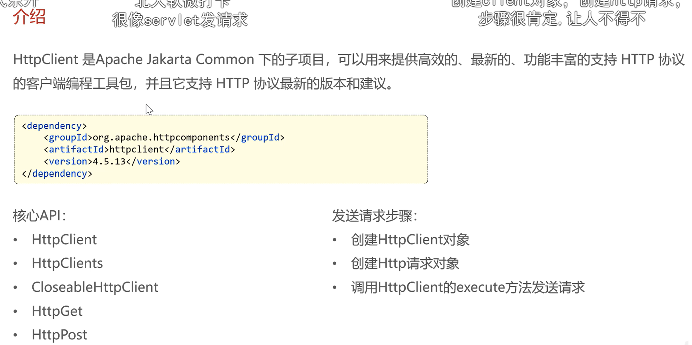

# day6

## Day06

### 1、HttpClient（Day06‑01\~06‑04）

HttpClient：【后端 Java 代码】发请求给另一个后端来获得数据

- 痛点：Java 后端，需要在服务端主动向外发送 HTTP 请求（调用别的第三方 http 接口）。普通 RestTemplate 也可以，但 HttpClient 是更成熟工具。

> 原本场景：后端调用微信开放平台接口拿 openid（我们业务跳过真实微信调用，但是 HttpClient 技术保留学习）
> 
> 

- 引入：Apache HttpClient

- 用来干什么：Java 代码内部，模拟客户端发送 GET/POST http 请求，拿到第三方返回的数据。

- 解决问题：后端服务主动调用外部 HTTP 接口的能力。

- 掌握程度：会写基础 GET、POST 请求代码；看得懂返回结果。不用深挖底层 socket 原理。

> 简历写：使用 HttpClient 实现服务端 HTTP 调用。我们项目实际业务不用它对接微信，但技术本身要会。
> 
> 

### 2、微信小程序整套 \+ 真实微信登录（Day06‑05\~18 直接跳过）

- 痛点：用户小程序端免密登录

- 引入：微信小程序 \+ 微信开放平台接口

- 解决：小程序用户一键登录获取 openid

- 掌握程度：完全不用实现，业务模拟伪造 openid 即可。只需要知道业务流程：小程序传 code→后端调用微信接口得到 openid，到此为止，不用写对接微信的代码。

### 3、导入商品浏览功能代码 Day06‑19、20

- 痛点：C 端用户需要查看菜品、套餐列表

- 引入：已写好的 Controller、Service、Mapper

- 解决：C 端商品查询接口，给用户浏览菜品

- 掌握程度：看懂接口入参出参，会测试接口；看懂业务逻辑。不需要从零手写，这节课是导入现成代码。

## Httpclient



httpclient是一个接口

closablehttpclient是一个实现类；

已经封装成一个工具类了；

## 微信小程序开发

跳过 解决方法

改一下service其他不变

```Java
package com.sky.service.impl;

import com.alibaba.fastjson.JSON;
import com.alibaba.fastjson.JSONObject;
import com.sky.constant.MessageConstant;
import com.sky.dto.UserLoginDTO;
import com.sky.entity.User;
import com.sky.exception.LoginFailedException;
import com.sky.mapper.UserMapper;
import com.sky.properties.WeChatProperties;
import com.sky.service.UserService;
import com.sky.utils.HttpClientUtil;
import lombok.extern.slf4j.Slf4j;
import org.springframework.beans.factory.annotation.Autowired;
import org.springframework.stereotype.Service;

import java.time.LocalDateTime;
import java.util.HashMap;
import java.util.Map;

@Service
@Slf4j
public class UserServiceImpl implements UserService {

    //微信服务接口地址
    public static final String *WX_LOGIN *= "https://api.weixin.qq.com/sns/jscode2session";

    @Autowired
    private WeChatProperties weChatProperties;
    @Autowired
    private UserMapper userMapper;

    */***
*     * 微信登录*
*     * @param userLoginDTO*
*     * @return*
*     */*
*    *public User wxLogin(UserLoginDTO userLoginDTO) {
        String openid = getOpenid(userLoginDTO.getCode());

        //判断openid是否为空，如果为空表示登录失败，抛出业务异常
        if(openid == null){
            throw new LoginFailedException(MessageConstant.*LOGIN_FAILED*);
        }

        //判断当前用户是否为新用户
        User user = userMapper.getByOpenid(openid);

        //如果是新用户，自动完成注册
        if(user == null){
            user = User.*builder*()
                    .openid(openid)
                    .createTime(LocalDateTime.*now*())
                    .build();
            userMapper.insert(user);
        }

        //返回这个用户对象
        return user;
    }

    */***
*     * 调用微信接口服务，获取微信用户的openid*
*     * @param code*
*     * @return*
*     */*
*    *private String getOpenid(String code){
//        //调用微信接口服务，获得当前微信用户的openid
//        Map<String, String> map = new HashMap<>();
//        map.put("appid",weChatProperties.getAppid());
//        map.put("secret",weChatProperties.getSecret());
//        map.put("js_code",code);
//        map.put("grant_type","authorization_code");
//        String json = HttpClientUtil.doGet(WX_LOGIN, map);
//
//        JSONObject jsonObject = JSON.parseObject(json);
//        String openid = jsonObject.getString("openid");
//        return openid;
        // 本地开发模拟伪造openid，code参数直接忽略
        String mockOpenId = "mock_mini_00001";
        *log*.info("本地模拟微信登录，忽略code={}, 使用mock openid={}", code, mockOpenId);
        return mockOpenId;
    }
}
```

## 商品浏览


