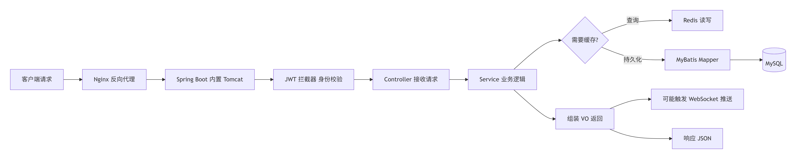

# 项目苍穹外卖

前面4day就是其实还是类似于前面的小案例就是

## Goal

1. 就是知道每一个是什么细节

## inspiration

1. 大部人是10\-12天你自己是比较高水平  就是必需要10天内干完；

* [ ] 自己跟这个过一遍

* [ ] 完全独立敲一次  逻辑自己说给自己听逻辑跑通；

* [ ] 画个图流程图（包括自己用到的什么技术）充当什么作用；

* [ ] 总结一下文档发在csdn

* [ ] 有一些人是会多次刷项目你自己

* [ ] 【】 过一段时间二刷总结讲给别人听

* [ ] 

## todo：

1. 就是自己弄到自己的github上

2. 自己写一个总结；一些图片就是流程图；可以类似与https://cloud\.tencent\.com/developer/article/2526884从零到一还有就是弄一些思维导图

3. 还有就是哔哩哔中有一个视频

4. 还有就是ai的

5. 不洗碗工作室就是跟苍穹外卖有点类似是不是自己可以就是把这个写进自己的项目里面   

https://chat\.deepseek\.com/a/chat/s/deb99891\-a99c\-47ee\-a889\-0a29a4540964

6. 改进or写下一ge   澡堂管理系统 / 食堂管理系统

7. 自己用ai来尝试就是用这个来实现一下就是给学校食堂的功能的这个；改成食堂点餐的；


8. 自己实现一下小程序or支付

9. 

## 资料

1. https://www\.cnblogs\.com/blfbuaa/p/19204247问题

2. https://blog\.csdn\.net/chen\_si\_shang\_/article/details/159735712总结

3. https://cloud\.tencent\.com/developer/article/2526884从零到一

4. https://chat\.deepseek\.com/a/chat/s/deb99891\-a99c\-47ee\-a889\-0a29a4540964

5. https://blog\.csdn\.net/chan12345678910/article/details/147051485?ops\_request\_misc=elastic\_search\_misc\&request\_id=50e11003249d2fca48ddc9e344200c42\&biz\_id=0\&utm\_medium=distribute\.pc\_search\_result\.none\-task\-blog\-2\~all\~top\_positive\~default\-2\-147051485\-null\-null\.142^v102^pc\_search\_result\_base1\&utm\_term=%E8%8B%8D%E7%A9%B9%E5%A4%96%E5%8D%96\&spm=1018\.2226\.3001\.4187   day1

## Tolearn

1. Redis 

2. Spring cache缓存

3. httpclient

4. poi  操作excel

5. jwt

6. 注解 Spring task websokect

7. ssm基础

8. mybatisplus

9. 缓存

10. Linux

11. Mysql 事务索引

12. 文件上传 oss

13. swagger/ knife4j 接口文档

14. 对象转换 dto\-》entity \-》vo

15. Threadlocal  

16. Bcrypt 加密存储

？我自己可以就是根据就是这个原型来分析出来·需求and如何实现

能力目标：

- 需求分析能力

    1. 有能力根据产品原型进行需求分析

    2. 有能力根据产品原型分析出对应接口

- 设计能力

    1. 能够根据产品原型设计简单的数据库模型

    2. 能够根据产品原型进行接口设计

    3. 能够根据产品原型设计DTO和VO

- 编码能力

2\. 能够熟练应用SpringBoot、Springmvc、mybatis等基础框架

3\. 熟练掌握SQL的编写

4\. 能够根据开发文档开发简单的单体项目

5\. 能够对前端代码进行打包和运行

6\. 能够修改和后端服务交互的前端代码

- 自学能力

    1. 能够根据第三方服务提供的开发文档编写例子程序

    2. 能够根据第三方服务提供的开发文档自学并应用到项目中



## Why 自己去看

1. 每一部分为什么要用这个来实现；用别的可不可以；

## 功能部分

1. 端口：？用户和管理

2. 员工登录认证   jwt

3. 菜品增删改查

用户  查找 缓存 ？图片 oss/本地虚拟路径   数据在mysql   加速redis先

加速缓存 spring cache   修改时候清理缓存 

4. 购物车 redis

5. 微信支付 模拟支付 mysql事务


6. 订单状态定时管理 spring task

7. 来单催单网络协议 websokect；

\[客户端请求\]

\|

v

\(1\) Nginx \(可选\) \-\-\> 反向代理、负载均衡

\|

v

\(2\) Spring Boot 内嵌 Tomcat 接收请求

\|

v

\(3\) JWT 拦截器 \(JwtTokenAdminInterceptor\)

\|\-\- 使用 JWT 工具类 解析 token

\|\-\- 将用户ID存入 ThreadLocal \(BaseContext\)

\|

v

\(4\) Spring MVC Controller \(@RestController\)

\|\-\- 参数校验 \(@RequestBody \-\> DTO\)

\|

v

\(5\) Service 层 业务逻辑

\|\-\- 权限判断 \(从ThreadLocal取ID\)

\|\-\- 操作 Redis 购物车/缓存 \(RedisTemplate\)

\|\-\- 调用 Mapper \(MyBatis\)

\|\-\- 对象转换用 BeanUtils/MapStruct

\|\-\- 需要时发送 WebSocket 消息

\|

v

\(6\) MyBatis Mapper \-\> \(7\) MySQL 数据库

\|\-\- 写入订单、菜品等数据

\|\-\- 读取/更新后清 Redis 缓存


\-\- 独立的后台任务：

\(8\) Spring Task 每分钟扫描超时订单并处理

\-\- 支付流程：

\(9\) 调用微信支付 SDK \-\> 接收回调更新订单

\-\- 文件上传：

\(10\) MultipartFile 接收 \-\> OSS SDK 上传 \-\> 返回URL

苍穹外卖项目（12天）分布如下：

第一章：环境搭建（1天）

day01：项目概述、环境搭建

第二章：基础数据维护（3天）

day02：员工管理、分类管理

day03: 菜品管理

day04：项目实战（套餐管理）

第三章：点餐业务（6天）

day05：店铺营业状态设置

day06：微信登录、商品浏览

day07：缓存商品、购物车

day08: 用户下单、订单支付

day09: 项目实战（历史订单、订单管理）

day10: 订单状态定时处理、来单提醒和客户催单

第四章：数据统计（2天）

day11: 数据统计（图形报表）

day12: 数据统计（Excel报表）

## 自己学习记录

### day1

？只是某一个商家的外卖平台那可以是实现多个商家入驻吗就是比较复杂的那种；

其实更像是一个学校食堂的那种

？这里可以就是结合实际需求比如学校or自己身边有一些需求的店铺；

？可以加入骑手端

#### 需求分析


1\.1 用户\-小程序

|授权登录||||
|---|---|---|---|
|购物车|1. 空<br>2. 有\-<br>3. 打样|||
|结算|方式|||
|||||
|||||
|||||
|||||
|||||
|||||
|||||

1\.2 商家\-web 

登录

|员工管理|启用\&禁用||||
|---|---|---|---|---|
|分类 （菜品和套餐）|||||
|菜品管理|开售|显示了|||
||停售||||
|套餐管理|||||
|优惠券|||||
|营业状态|||||
|订单管理|all/待接单/待派送/派送中/已完成/已取消||||
|提醒和接单声音|拒绝订单<br>催单||||
|数据统计|分日期||||
||分类了||||
|工作台|主要是今日的东西||||

#### 软件开发流程

流程


软件环境


#### 项目介绍

项目定位（背景功能）


功能架构：业务模块

管理：登录jwt

？加入骑手端

？自己改造一下就是可以用作学校奶茶店的销售的一个店面的一个小程序；


产品原型（从登录的html进入）


技术选型

？什么时候

？how

？则么有这么多层

？nginx（1\. 反向代理 2\. web服务器）

Spring cache 缓存

阿里云oss存储东西

poi（操作excel表）

websokect（网络协议，催单，来单提醒）

redis缓存中间件

junit：单元测试


#### 开发环境搭建

4\.1整体架构

？小程序


4\.2 前端

管理端是web 用得是nginx来实现的

双击nginx\.exe**（要在没有中文的目录）**

？端口号：80（看ngix中conf中的listen，可以改一下因为stream之类的代理还是会占用这个端口）

?还是闪退  有东西如代理占用了80端口号要在web端进入；


4\.3 后端

？pojo包括

Dto数据传输对象

vo值对象

entity


common一般是被依赖的模块


dto：前端给后端

vo：后端给前端

entity：对应的是数据库的实体类

dtovo可以少or多都是可以的；


**？就是其实初始工程是不完整的就是有很多问题 1\. Log 2\. 支付类哪里；skip**

4\.3\.2 ？git

本地仓库\-远程仓库\-push

Ignore\(与maven的pom xml resources exclude 不一样就是其实

- 语法基础：`*`、`**`、`/` 结尾、`!` 否定，这些必须熟练到不用查资料。

- 按技术栈写核心忽略：

    - 做 Java：`target/`、`*.class`、`.idea/`、`*.iml`。

4\.3\.3数据库

执行sql脚本


4\.4前后段联调

遇到问题看看弹幕就是其实是有很好的解答

log：没有找到 \-》maven  

1. 我下载的是mvnd对应的 重新下载之后就是又配置了一次

镜像\-外网忙

2. ?就是乱码 这里超级奇怪

3. 还有就是cannot find symbol log jdk和lombok版本不兼容 就是我用的是jdk25但是就是必须得用最新的lombok；更新为最新的

4. 登录不进去\-》改数据库username和password

application\-dev\.yml与之前学过的appplication\.properties都是连接数据库的用yml is better

```Java
//properties
spring.application.name=SpringBootWebCase1
mybatis.configuration.map-underscore-to-camel-case=true
spring.datasource.url=jdbc:mysql://localhost:3306/springbootwebcase
spring.datasource.password=123456
spring.datasource.username=root
# PageHelper 分页插件配置
pagehelper.helper-dialect=mysql
pagehelper.reasonable=true
pagehelper.support-methods-arguments=true
pagehelper.params=count=countSql

//yml
spring:
database:
url:jdbc:mysql://localhost:8080/springbootwebcase
username:root
password:123456
```

idea没有了；？

有些代码没有学过看懂；

？jwt令牌

#### ngix


前端http\-》ngnix反向代理（中间：可以有缓存提高速度，负载均衡；没有直接连接安全）\-》tomcat


反向代理：


负载均衡：基于反向代理

配置一组服务器 （红色名字而已相同即可）


策略：

轮询：你一个我一个

ip\_hash：同一个ip在同一个上


4\.5 完善登录功能

？优化：用别的加密算法（但是知道有什么加密方法就是觉得md5这个不好）

- 首选方案：对于绝大多数项目，包括“苍穹外卖”，使用 `BCryptPasswordEncoder` 完全足够，且实现最简单。

- 进阶方案：如果你的项目有非常严格的安全合规要求，可以考虑 Argon2id。

密码直接是显示在数据库上不安全；用md5加密之后放在数据库上；之后用加密的与得到的比较；

md5解密不了（数学上）但是工程上可以

缺点：1\. 无盐 2\. 可以枚举and破译（速度快）


**debug\(断点调试知道去向）**：nextline；step in/out ；放行到下一个断点位置；

**可以加一个todo标签**

传入employeelogindto（username\+password）

contorller\-》employeeservice（login（加密密码MD5）\-》empmapper中的getbyusername得到employee、\-》mybatis\-》mysql

\-》返回employeeservice  判断null\(异常accountnotfoundexception中有messagaeconstant） password（密码md5加密之后再与这个比较）（passworderrorexception）\-\>status（statusconstant）\-》employeecontroller（生成jwt令牌（jwtutilcomon中 jwtproperties配置属性类common中） employeeloginvo）并return

?配置类：yml yml

?builder\-\>add@builder

全局异常捕获器在server中的handler

异常

?上面抛出的异常都是继承自baseexception

```Java
package com.sky.handler;

import com.sky.exception.BaseException;
import com.sky.result.Result;
import lombok.extern.slf4j.Slf4j;
import org.springframework.web.bind.annotation.ExceptionHandler;
import org.springframework.web.bind.annotation.RestControllerAdvice;

*/***
* * 全局异常处理器，处理项目中抛出的业务异常*
* */*
@RestControllerAdvice
@Slf4j
public class GlobalExceptionHandler {

    */***
*     * 捕获业务异常*
*     * @param ex*
*     * @return*
*     */*
*    *//多态
    @ExceptionHandler
    public Result exceptionHandler(BaseException ex){
        *log*.error("异常信息：{}", ex.getMessage());
        return Result.*error*(ex.getMessage());
    }

}
```

？仔细看看

？配置属性类

```Java
//登录成功后，生成jwt令牌
Map<String, Object> claims = new HashMap<>();
claims.put(JwtClaimsConstant.*EMP_ID*, employee.getId());
//没有写死
String token = JwtUtil.*createJWT*(
        jwtProperties.getAdminSecretKey(),
        jwtProperties.getAdminTtl(),
        claims);
//employee serializable
EmployeeLoginVO employeeLoginVO = EmployeeLoginVO.*builder*()
        .id(employee.getId())
        .userName(employee.getUsername())
        .name(employee.getName())
        .token(token)
        .build();
```

#### 导入接口文档

？todo：用apifox来代替swagger和yapi

yapipro太卡了：

Apifox = Postman \+ Swagger \+ Mock \+ JMeter


#### swagger


扫描本包和子包

？配置类（在server）and修改

在配置类中加入这行代码

？todo看懂这个代码


访问：localhost：8080/doc\.html 如果没有静态资源这个映射就是会以为是这个是某一个controller 

用apifox整合


- 常用注解


## day1

用完整的代码

？why这么多bug（其实是自己根本没有了解到底要干什么直接开始想着拉下

1. 报错：\-》没有引入依赖 wrong 版本不兼容 \-》Lombok和Java

bug1:

java: java\.lang\.ExceptionInInitializerError

com\.sun\.tools\.javac\.code\.TypeTag :: UNKNOWN

\-》pomjava和lombok都要改  ，还有file project structure language中运行的语言改为17

bug3:


bug2:

The goal you specified requires a project to execute but there is no POM in this directory \(C:\\LearningResources\\no\-washing\-club\\sky\_take\_out\\resources\\resources\\day12\\项目完整版代码\\workspace\)\. Please verify you invoked Maven from the correct directory\. \-\>》terminal实在workspace中我没有cd sky\_take\_out

bug4:

Unresolved dependency: 'com\.github\.wechatpay\-apiv3:wechatpay\-apache\-httpclient:jar:0\.4\.12'\-》  

1. 没有下载完 or 下载有残留

先去仓库/用户/12345/\.m2/repository删掉之后重下  

### bug5：java: 程序包com\.sky\.result不存在

- 全类名

路径：src/main/java 下之后的路径

不同的如引用：在pom\.xml引入用到的目录的依赖

### bug6：微信支付的jar包 and 跳过微信支付

- Could not find artifact com\.github\.wechatpay\-apiv3:wechatpay\-apache\-httpclient:pom:0\.4\.12 in aliyunmaven 

1. ~~太老了 ~~

2. 自己配的是阿里云镜像黑马给的资料是version0\.4\.12实际上central有但是阿里云镜像没有换成有的0\.6\.0version

3. 跳过微信支付or其他就是不加入依赖这个依赖又什么用（前人已经创造好的工具给你封装起来直接用即可）

4. 没有尝试直接手动下载到本地对应的mvn\_rep;

记得改老师给的数据库连接配置

标红的一个jwt地方法\-》jjwt/jwt不同的版本给接口不同；


