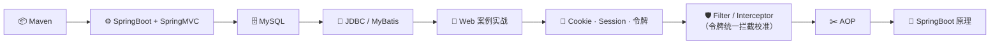
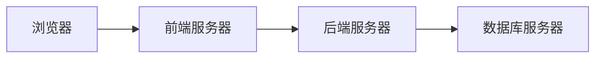

# Web 全栈开发学习路线与核心知识梳理

---

## 一、学习路线总览

---

## 二、Web 开发架构

### 前后端分离架构

- **前端代码**：通过浏览器的解析和渲染转换成可视化的网页
- **开发模式**：前后端分离开发

---

## 三、Web 标准

Web 标准由三部分组成：

| 组成部分 | 作用 |
|---------|------|
| **HTML** | 页面结构 |
| **CSS** | 页面样式 |
| **JavaScript** | 页面交互 |

---
