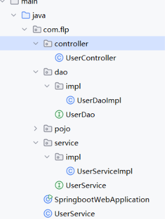

# Spring 核心：IOC 与 DI

> 这是 Spring 框架最核心的机制 <br>
> 核心思想：把对象的创建权和依赖管理权交给 Spring 容器。

---

## 一、三层架构

```text
Controller（接受请求、响应数据）
    ↓
Service（业务逻辑层）
    ↓
DAO（数据访问层）
```

| 层次 | 职责 | 常用注解 |
|------|------|---------|
| Controller | 接受请求、响应数据 | `@Controller` / `@RestController` |
| Service | 业务逻辑处理 | `@Service` |
| DAO | 数据访问（数据库操作） | `@Repository` |

### 设计原则

- **单一职责原则**：每层只做自己的事
- **便于复用、后期维护**
- **Service 和 DAO 都是接口 + 实现类**
- 体现 **面向接口编程**、**向上转型**

### 为什么用接口 + 实现类？

```java
// 接口
public interface UserService {
    User getById(Long id);
}

// 实现类
@Service
public class UserServiceImpl implements UserService {
    @Override
    public User getById(Long id) {
        // ...
    }
}
```

**好处**：

- **解耦**：Controller 依赖接口，不依赖具体实现
- **可替换**：换实现类不影响调用方
- **便于测试**：可以用 Mock 实现

---

## 二、分层解耦：IOC 和 DI

### 1. IOC（控制反转）

- **Inversion of Control**
- 传统方式：对象由程序员自己 `new`
- IOC 方式：对象由 Spring 容器创建和管理
- 控制权从程序员**反转**到了 Spring 容器

### 2. DI（依赖注入）

- **Dependency Injection**
- 容器把依赖的对象**注入**到需要的地方
- 是 IOC 的具体实现方式

### 3. 一句话理解

> **IOC 是思想，DI 是实现。**
> 把对象交给 Spring 管，需要的时候 Spring 自动给你。

---

## 三、Bean 注册注解

要把某个对象交给 IOC 容器管理，需要在这个类上加注解。

> **前提条件**：必须和启动类在 **当前包及其子包下**。

| 注解 | 标注位置 | 说明 |
|------|---------|------|
| `@Component` | 任意类 | 通用注解 |
| `@Controller` | 控制层 | 标注在 Controller 上 |
| `@Service` | 业务逻辑层 | 标注在 Service 上 |
| `@Repository` | 数据访问层 | 标注在 DAO 上 |

### 说明

- 生成的对象会放在 IOC 容器中
- 默认名字为 **类名首字母小写**
  - `UserService` → `userService`
  - `UserServiceImpl` → `userServiceImpl`

### 示例

```java
@Service
public class UserServiceImpl implements UserService {
    // ...
}
```

---

## 四、依赖注入的方式

### 方式一：属性注入

```java
@RestController
public class UserController {

    @Autowired
    private UserService userService;
}
```

**特点**：

- 写法简单
- 但不利于单元测试
- 不能注入 `final` 字段

### 方式二：构造器注入（推荐）

```java
@RestController
public class UserController {

    private final UserService userService;

    // 如果当前类只有一个构造函数，@Autowired 可以省略
    public UserController(UserService userService) {
        this.userService = userService;
    }
}
```

**特点**：

- 可以注入 `final` 字段，保证不可变
- 便于单元测试
- 依赖关系清晰
- **Spring 官方推荐**

### 方式三：Setter 注入（了解）

```java
@RestController
public class UserController {

    private UserService userService;

    @Autowired
    public void setUserService(UserService userService) {
        this.userService = userService;
    }
}
```

---

## 五、@Autowired 注入冲突

### 问题

`@Autowired` 是 **按类型注入** 的。

如果 `UserService` 有多个实现类，会报错：

```text
NoUniqueBeanDefinitionException:
expected single matching bean but found 2
```

因为 `@Autowired` 无法区分你具体需要哪一个。

### 解决方案

#### 方案一：@Primary

在其中一个实现类上加 `@Primary`，让它成为默认首选。

```java
@Service
@Primary
public class UserServiceImpl implements UserService {
    // ...
}
```

#### 方案二：@Qualifier

在注入时指定 Bean 的名字。

```java
@Autowired
@Qualifier("userServiceImpl")
private UserService userService;
```

#### 方案三：@Resource

按名字注入（JDK 自带注解）。

```java
@Resource(name = "userServiceImpl")
private UserService userService;
```

### 三者对比

| 注解 | 来源 | 注入方式 |
|------|------|---------|
| `@Autowired` | Spring | 按类型 |
| `@Qualifier` | Spring | 配合 `@Autowired` 按名字 |
| `@Resource` | JDK（JSR-250） | 默认按名字 |

---

## 六、完整示例



### 1. Controller 层

```java
package com.flp.controller;

@RestController
public class UserController {
    @Autowired
    private UserService userService;

    @RequestMapping("/list")
    public List<User> list() throws Exception{
        //调用service，获取数据
        List<User> userList = userService.findAll();
        //返回响应体
        return userList;
    }
}

```
### 2. Service 层

```java
package com.flp.service;

public interface UserService {
    public List<User> findAll();
}

package com.flp.service.impl;

@Service
public class UserServiceImpl implements UserService {

    @Autowired
    private UserDao userDao;
    @Override
    public List<User> findAll() {
        //调用dao
        List<String> lines = userDao.findAll();
        //再解析信息
        List<User> userList = lines.stream().map(line->{
            String[] parts = line.split(",");
            Integer id = Integer.parseInt(parts[0]);
            String username = parts[1];
            String password = parts[2];
            String name = parts[3];
            Integer age = Integer.parseInt(parts[4]);
            LocalDateTime updateTime = LocalDateTime.parse(parts[5], DateTimeFormatter.ofPattern("yyyy-MM-dd HH:mm:ss"));
            return new User(id, username, password, name, age, updateTime);
        }).toList();

        return userList;
    }
}

```

### 3. DAO 层

```java
package com.flp.dao;

public interface UserDao {
    public List<String> findAll();
}


package com.flp.dao.impl;

@Repository
public class UserDaoImpl implements UserDao {
    @Override
    public List<String> findAll() {
        //先读取txt
        InputStream in = this.getClass().getClassLoader().getResourceAsStream("user.txt");
        List<String> lines = IoUtil.readLines(in, StandardCharsets.UTF_8, new ArrayList<>());
        return lines;
    }
}
```


### 4. 调用链

```text
浏览器请求 /list
    ↓
UserController中调用userService.findAll()
    ↓
UserServiceImpl中调用userDao.findAll()
    ↓
UserDaoImpl执行findAll()得到数据
    ↓
UserServiceImpl执行业务
    ↓
UserController
返回 User 对象 → 转 JSON → 响应
```

---

## 七、常见问题

### 1. 为什么必须和启动类在同包或子包下？

Spring Boot 默认扫描启动类所在包及其子包。
如果不在，需要手动加 `@ComponentScan`。

### 2. Bean 默认是单例吗？

是的，Spring Bean 默认是 **单例（Singleton）**。

### 3. 构造器注入为什么可以省略 @Autowired？

如果类只有一个构造函数，Spring 4.3 之后会自动用它注入。

### 4. @Autowired 和 @Resource 的区别？

| 对比 | @Autowired | @Resource |
|------|-----------|-----------|
| 来源 | Spring | JDK |
| 默认注入方式 | 按类型 | 按名字 |
| 配合注解 | `@Qualifier` | `name` 属性 |
| 适用 | Spring 项目 | 通用 |

---

## 八、小结

| 知识点 | 核心内容 |
|--------|---------|
| 三层架构 | Controller → Service → DAO |
| 单一职责 | 每层只做自己的事 |
| 接口 + 实现 | 面向接口编程，便于复用和维护 |
| IOC | 对象创建权交给 Spring |
| DI | 容器自动注入依赖 |
| Bean 注解 | `@Component` / `@Controller` / `@Service` / `@Repository` |
| 注入方式 | 属性注入、构造器注入（推荐）、Setter 注入 |
| 注入冲突 | `@Primary` / `@Qualifier` / `@Resource` |